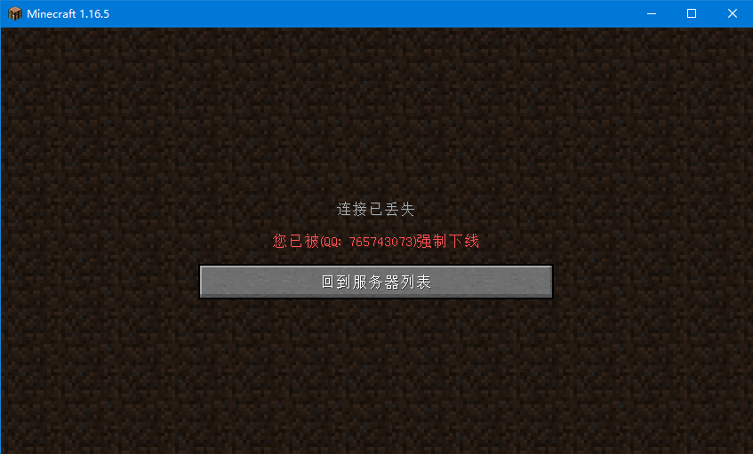
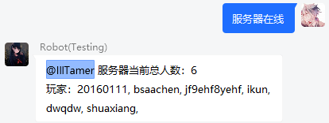

# Infinite Bot 3 - BasicManager(基础管理) 1.0
 
## 关键词列表

| 关键字 | 监听范围 | 权限等级 |
| :----: | :----: | :----: |
| 今日新玩家 | 全局 | 管理员 |
| 我的绑定 | 全局 | 无 |
| 强制下线 | 全局 | 无 |
| 服务器在线 | 单元格 | 无 |

## 指令

> Notice: `[]` 表示监听范围 `()` 表示权限等级

- 基础申请绑定: `[组]` `(无)`

    玩家在群内发送 '绑定 正版/离线 <游戏名>'，在游戏内按指示输入即可完成绑定

- 更改绑定: `[组]` `(无)`

    玩家在群内发送 '改绑 正版/离线 <游戏名>'，在游戏内按指示输入即可完成绑定

## 配置文件

[[config.yml]](src/main/resources/config.yml)

## 演示

### 今日新玩家

### 我的绑定

### 强制下线

### 服务器在线

