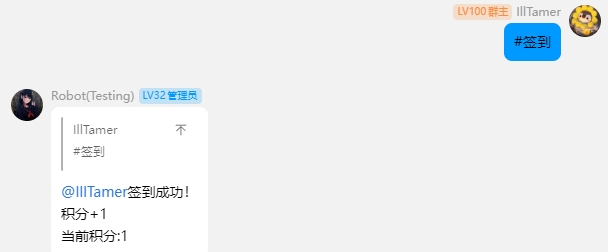
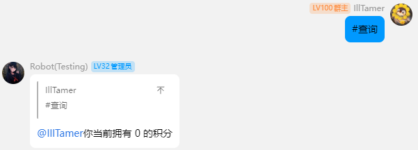
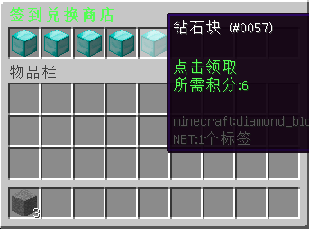

# BotShop - 机器人签到商店附属

> 本附属为外置附属，请将附属放在 `plugins` 文件夹下，附属将作为 bukkit 插件正常加载

## 关键词列表

| 关键字 | 监听范围 | 权限等级 |
|:---:|:----:|:----:|
| #签到 | 配置的群 |  无   |
| #查询 | 配置的群 |  无   |

## 插件指令

根指令 `botshop`

- `/botshop gui ➥ 打开积分商店`
- `/botshop add [player] [num] ➥ 给玩家添加积分`
- `/botshop take [player] [num] ➥ 扣除玩家的积分`
- `/botshop reload ➥ 重载配置文件`

## 配置文件

[[config.yml]](src/main/resources/config.yml)

## 演示

### 签到

### 查询

### 游戏内积分兑换商店

