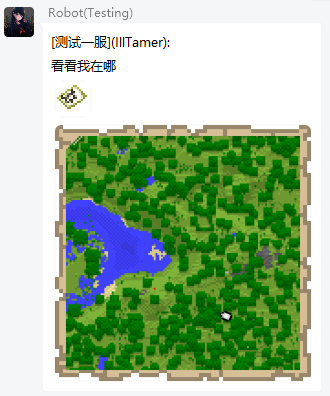

# ChatManager - 群与游戏消息互通附属

互通支持
- @: 群内@成员/@全体成员时，若被@者在服务器内且绑定游戏玩家，则游戏中会同样@该玩家
- 回复: 若被回复QQ绑定玩家且在线，则同样会@该玩家
- 图片 (**暂不支持**): 该功能需要开启 `expand-chat` 配置节点

## 指令

玩家在聊天界面输入 `#change 群号`，可针对群号切换自身消息接收状态 `接收`/`屏蔽`

## 变量

> 注意，下列变量需要 `placeholder-hook` 作为前置附属

- `%ib4_check-forward-group_{group_id}%` 检查玩家是否监听了某个群（玩家默认监听所有群）
- `%ib4_get-close-groups%` 获取玩家拒绝监听的所有群列表

## 配置文件

[[config.yml]](./src/main/resources/config.yml)

## 演示

### 群 -> 游戏

### 游戏 -> 群

