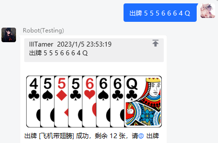

# Infinite Bot 3.1.7 - LandlordsGame(斗地主)

> 使用本附属时，请将您的 basic-manager 附属升级至2023-01-06之后的版本

## 指令

默认关键词列表

- 斗地主帮助
- 加入斗地主
- 抢地主
- 不抢
- 出牌
- 不要
- 中止游戏
- 查看手牌

## 配置文件

[[config.yml]](src/main/resources/config.yml)

## 演示

### 群聊

### 私聊

