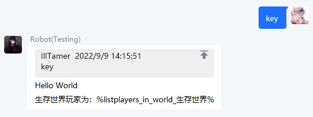
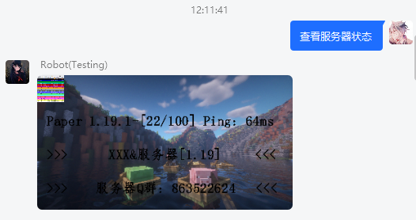
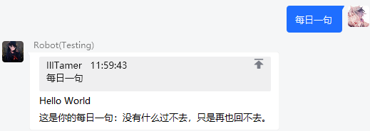
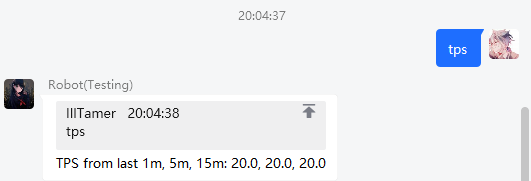

# Infinite Bot 3 - MessageManager(自定义消息附属) 2.0

## 说明

> 因本附属支持 PlaceholderAPI 变量，其内置与拓展变量对游戏内数据支持度极高，故本附属自身不提供与绑定玩家相关的内置变量，如有需要请配合 PlaceholderAPI 使用。

本附属支持四种消息展示方式

- `text`: 文本（支持变量）
- `image`: 图片（支持配置代理与调用网络图片、自由绘制图片）
- `api`: 调用 Web API 的内容（仅支持纯文本）
- `command`: 执行指令（部分类型支持回显）

## 依赖

### 软依赖

- PlaceholderAPI

## 配置文件

[[config.yml]](src/main/resources/config.yml)

## 演示

### text

### image

### api

### command

