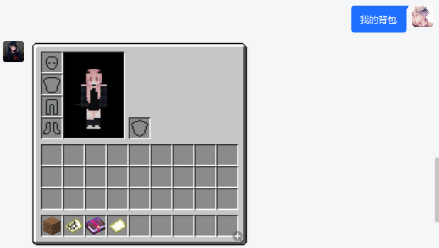
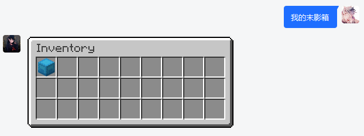
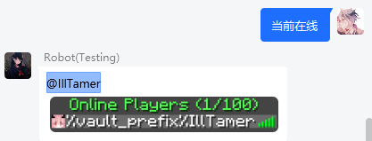

# Infinite Bot 3 - ViewManager(视图增强附属) 2.0

> 注：视图增强为其它附属（如消息互通）的增强前置附属，如您需要对该类附属进行功能增强，
请将本附属与其依赖附属安装在同一服务器下

## 关键词列表

| 关键字 | 监听范围 | 权限等级 |
| :----: | :----: | :----: |
| 我的背包 | 全局 | 无 |
| 我的末影箱 | 全局 | 无 |

## 依赖

### 硬依赖

- `InteractiveChatDiscordSrvAddon` [测试版本 4.2.3.1](https://ci.loohpjames.com/job/InteractiveChat-DiscordSRV-Addon/204/)

- `InteractiveChat` [测试版本 4.2.3.1](https://ci.loohpjames.com/job/InteractiveChat/146/)

- `DiscordSRV` [测试版本 1.26.0](https://github.com/DiscordSRV/DiscordSRV/releases/tag/v1.25.1)

## 配置文件

[[config.yml]](src/main/resources/config.yml)

## 演示

### 我的背包



### 我的末影箱



### 当前在线

> 对应变量需安装 PlaceholderAPI 拓展后方可展示



## 可能出现的问题

### 常见报错

```
java.lang.NullPointerException: Cannot invoke "com.loohp.interactivechatdiscordsrvaddon.resources.ResourceManager.getTextureManager()" because the return value of "java.util.function.Supplier.get()" is null
```

前置插件 `InteractiveChatDiscordSrvAddon` 在初始化时会自动异步下载服务器对应版本的材质，若使用插件时材质未下载完毕，则会出现此报错。耐心等待下载即可。

### 图片解析问题

在 catserver-1.12.2 中，附属前置插件 `InteractiveChat`, `InteractiveChat-DiscordSRV-Addon` 的功能会收到影响，其表现为

> 1. 展示变量如 `[i]`、`[e]` 等无法在游戏中进行解析
> 2. 消息互通增强功能开启后，群内发送的图片无法在游戏中查看

此种状况均为插件（或插件前置ProtocolLib）与服务器核心不兼容导致，与ic系列作者沟通记录如下:

- [catserver-1.12.2 Item render exceptions](https://github.com/LOOHP/InteractiveChat-DiscordSRV-Addon/issues/23)
- [Placeholders are just replaced once in catserver-1.12.2](https://github.com/LOOHP/InteractiveChat/issues/111)

### 地图加载不完全

如您在使用时发现游戏向Q群内展示的地图图片绘制不完全（部分空白），可关闭配置中 `game-to-group.async-render` 一项，即可恢复正常
